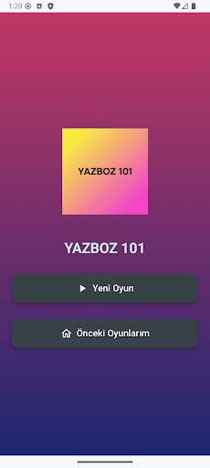
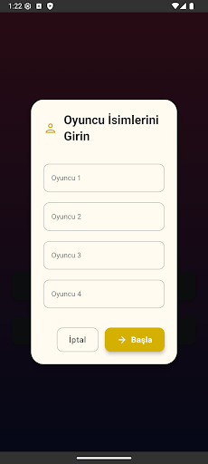
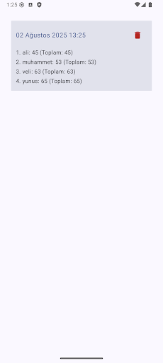
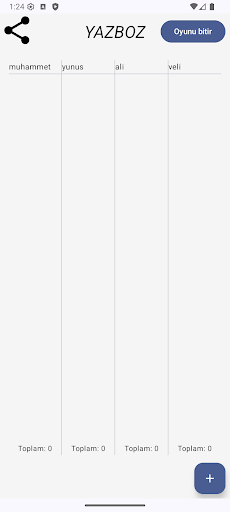

<div align="center">

# 🚀 Yazboz App

### A quick Yazboz for Okey Players

Yazboz 101 is a modern Android application for Okey Players. The app provides a digital scorekeeper for tracking multiple players' scores throughout the game, making it easier to focus on the fun without worrying about manual score calculation.

[Features](#-features) • [Screenshots](#-screenshots) • [Tech Stack](#-tech-stack) • [Getting Started](#-getting-started)

</div>

---

## 📱 Screenshots

<div align="center">

| Home | Add Players | Previous Games | Game Screen |
|:---:|:---:|:---:|:---:|
|  |  |  |  |
| You can start a new game or see your previous games | You can type players' name | You can see your previous games | Yazboz Screen |

</div>

---

## Download

<a href="https://play.google.com/store/apps/details?id=com.gundogar.yazboz101">
  
</a>

## ✨ Features

### 🎯 Core Functionality

- **Fast and easy**
- **Calculating your scores**
- **Save your games without internet connection**
- **Share game results with friends**

---

## 🛠️ Tech Stack

### Core Technologies

| Category | Technology |
|----------|------------|
| **Language** | Kotlin |
| **UI** | Jetpack Compose |
| **Local DB** | Room |
| **Asynchronous Operations** | Coroutines |
| **Dependency Injection** | Hilt |

---

## 🚀 Getting Started

### Prerequisites

MinSDK 26 required

### Installation

1. **Clone the repository**
   ```bash
   git clone https://github.com/bymaskeli53/Yazboz101

   ```

2. **Open the project with Android Studio**
   ```bash
   Run it
   ```

---

<div align="center">

### ⭐ Star this repository if you found it helpful!

**Made with ❤️**

</div>